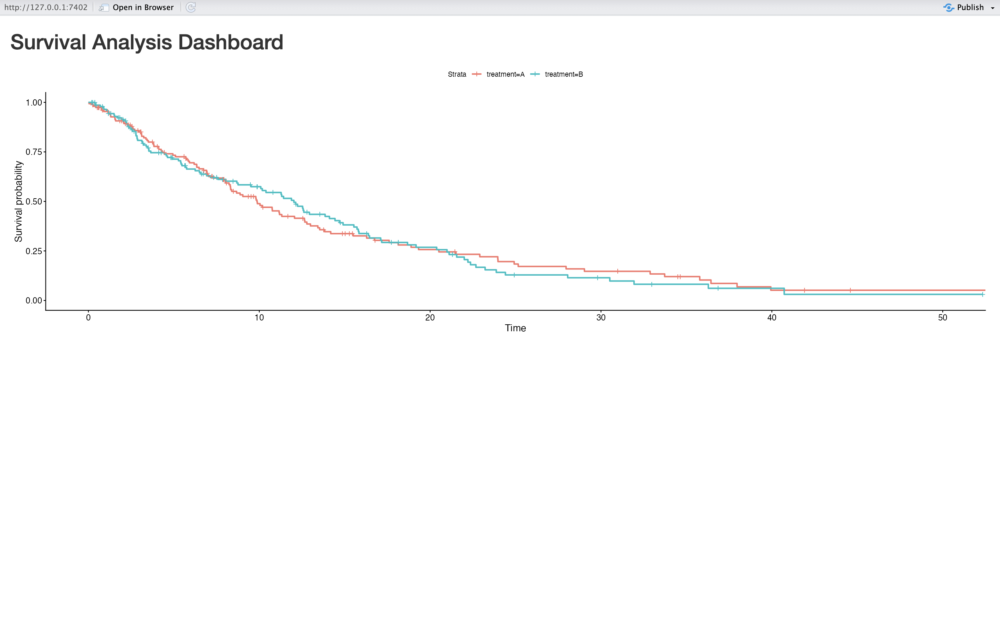

# Clinical Survival Analysis

## Overview
This project presents an end-to-end survival analysis workflow in R, simulating a clinical study with time-to-event outcomes. It demonstrates key statistical methods used in healthcare and pharmaceutical data science, including Kaplan-Meier estimation, Cox regression, and power analysis.

---

## Objectives
- Perform exploratory data analysis on clinical survival data  
- Estimate survival probabilities using Kaplan-Meier curves  
- Model time-to-event outcomes with Cox proportional hazards regression  
- Conduct sample size and power simulations  
- Develop reusable R functions for analysis workflows  
- Build an interactive Shiny dashboard for visualization  

---

## Methods

### Data Simulation
A synthetic clinical dataset was generated to mimic real-world survival data:
- Patient demographics (age)
- Treatment groups
- Biomarker values
- Time-to-event outcomes
- Event indicators (censored vs observed)

### Exploratory Data Analysis
- Summary statistics by treatment group  
- Event rates and survival time comparisons  

### Survival Analysis
- Kaplan-Meier estimator for survival curves  
- Log-rank test for group comparison  
- Cox proportional hazards model for multivariate analysis  

### Power Simulation
- Monte Carlo simulation to estimate statistical power  
- Demonstrates impact of sample size on detection of treatment effects  

### Reusable Functions
- Custom function for Kaplan-Meier estimation  
- Modular and reusable statistical workflow components  

### Interactive Dashboard
- Built using Shiny  
- Displays Kaplan-Meier survival curves  
- Enables intuitive visualization of survival differences  

---

## Key Findings
- Survival outcomes are similar across treatment groups in the simulated dataset  
- Low statistical power (~3%) highlights the importance of adequate sample size  
- Cox model demonstrates how covariates influence survival outcomes  

These results illustrate typical challenges in clinical trial analysis and decision-making.

---

## Shiny Dashboard

---

## Project Structure
- data/ # Simulated survival dataset
- R/ # Analysis scripts
- report/ # Figures and outputs
- app/ # Shiny dashboard
- README.md

## Reproducibility

Run scripts in the following order:

1. `01-load-data.R`  
2. `02-exploratory-analysis.R`  
3. `03-kaplan-meier.R`  
4. `04-cox-model.R`  
5. `05-sample-size.R`  

---

## Tools & Technologies
- R  
- tidyverse  
- survival  
- survminer  
- Shiny  
- Git & GitHub  